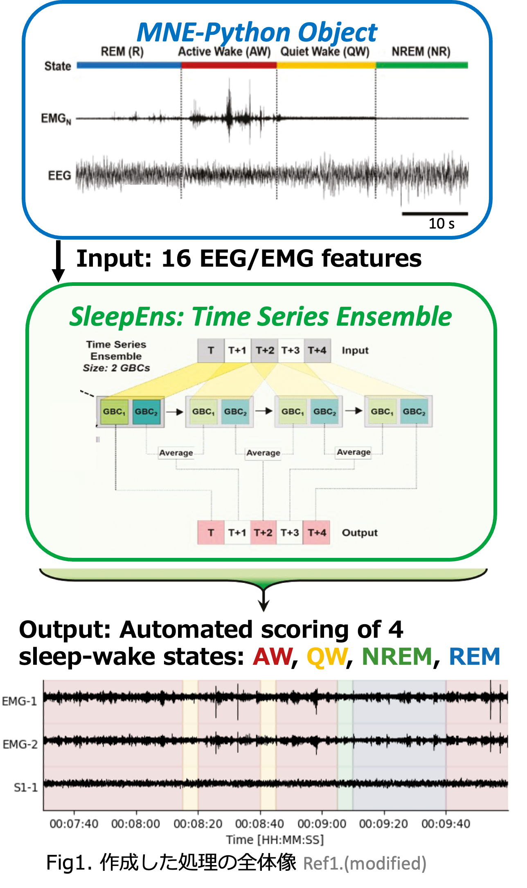
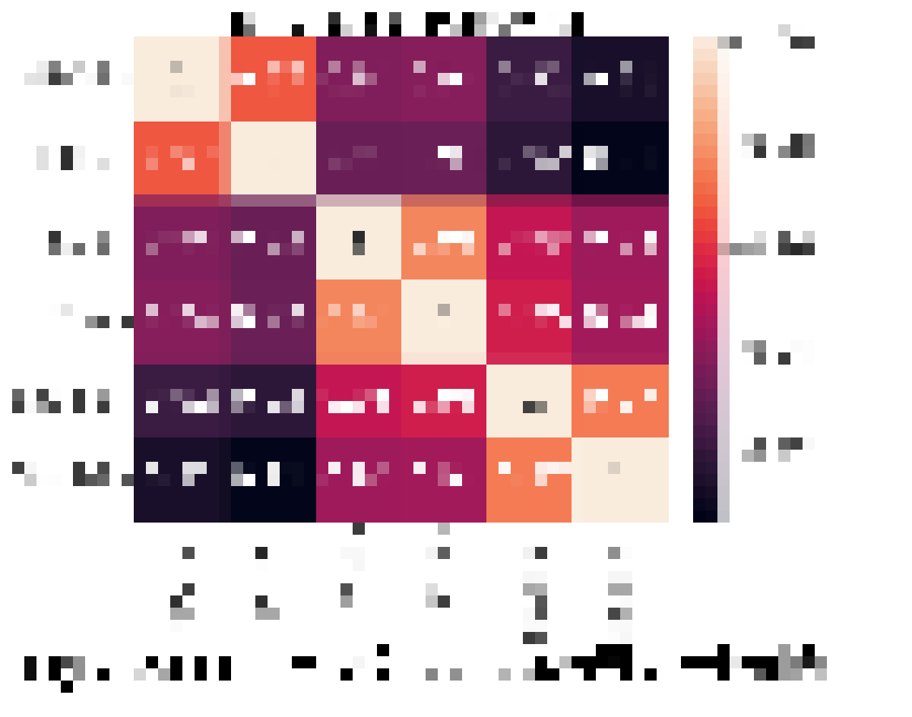
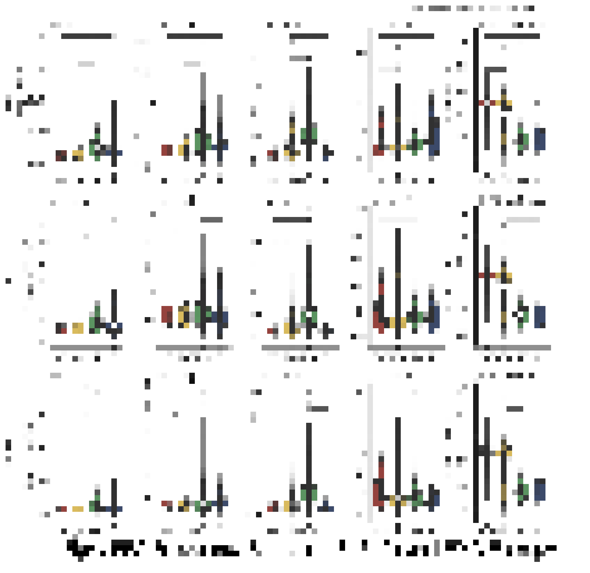
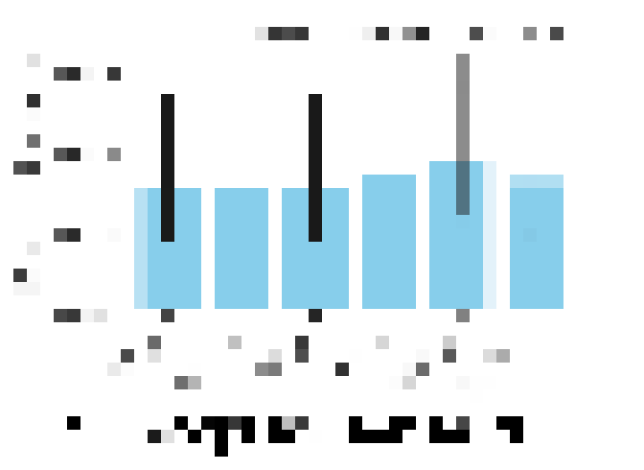

# Ikuma Fukumoto's Work

🇺🇸 English | [🇯🇵 日本語](./README_JPN.md)  
This directory contains the research notebooks\* by Ikuma Fukumoto during the FY2025 Laboratory Research, a third-year course at the Faculty of Medicine, Tokushima University.  
(\*Limited to the publicly shareable ones)  

## Development and Evaluation of a Machine Learning Algorithm for Classifying Mice Sleep and Wake States from Video

### abstract

When researching the relationship between sleep and motor function, analysing the arousal state within the four-state system comprising active wakefulness (AW), quiet wakefulness (QW), non-rapid eye movement (NREM) sleep, and rapid eye movement (REM) sleep. This approach **enhances the accuracy of behavioural analysis**. Evaluating these four brain states requires the implantation of electrodes for electroencephalogram/electromyogram (EEG/EMG) analysis. While accurate, this method incurs **significant costs** due to invasive surgery and the training of specialists to score EEG/EMG data [2]. This study aims to develop a methodology utilising cutting-edge computer vision techniques to directly classify sleep and wakefulness substages from video information. This eliminates the need for surgery and expert scoring, **paving the way for high-throughput sleep research using mice**.

---

### Results

Only the key results are shown. This image has been mosaic-processed as it is unpublished.

## Code Availability

- All analysis and visualisation code is contained within [notebooks](./notebooks) and [python/sleepens](./python/sleepens).
- The video conversion code used for sharing video data is contained within [python/h265encode](./python/h265encode).

## LICENSE

All license shall be governed by the [repository license](../LICENSE.md) unless otherwise explicitly stated.

## Requirements

The notebook's execution environment is scheduled for future release.

The SleepEns execution environment is stored in [python/sleepens/.venv](./python/sleepens/.venv).

## Citations

[1] Fraigne, J. J. et al.  Sleep 2023.  
[2] Geuther, B. et al. Sleep 2022.

## Log

- Created this directory: Oct. 24, 2025 (Kengo Watanabe)
- Uploaded the notebooks, scripts: Oct. 27, 2025 (Ikuma Fukumoto)
- Edit README: Oct. 27, 2025 (Ikuma Fukumoto)
